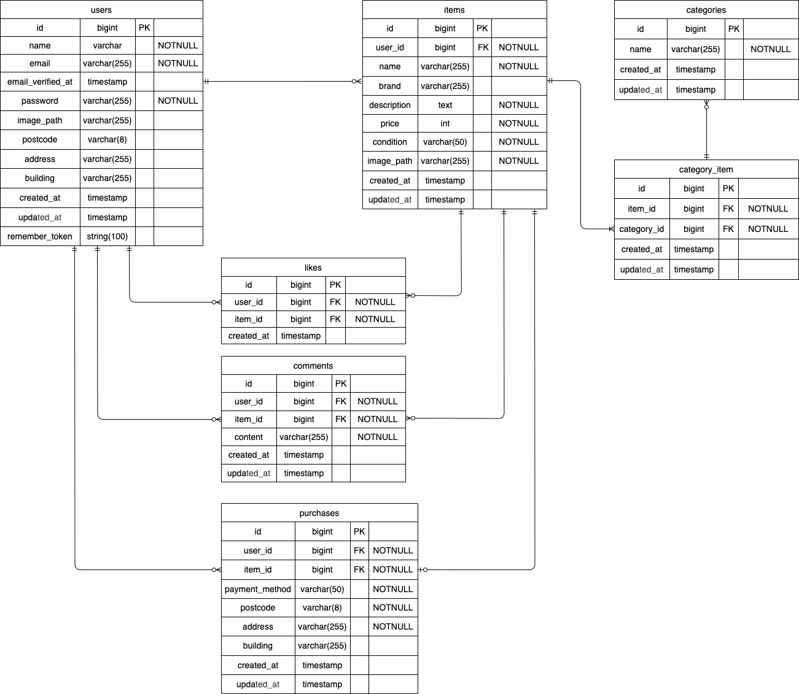

# coachtech_fleamarket_app

COACHTECH 模擬案件「coachtechフリマ」のアプリケーションです。  
ユーザー登録・ログイン・商品出品・商品購入・コメント・いいね・プロフィール編集・メール認証機能を実装しています。

---

## 環境構築

### Dockerビルド

```bash
git clone git@github.com:ikmi0723/coachtech-fleamarket-app.git
cd coachtech-fleamarket-app
docker compose up -d --build
```

---

## Laravel環境構築

```bash
docker compose exec php bash
composer install
cp .env.example .env
php artisan key:generate
php artisan migrate
php artisan storage:link
exit
```

---

## 使用技術（実行環境）

- PHP 7.3以上 / 8.0以上
- Laravel 8系
- Laravel Fortify 1.19系
- MySQL 8.0.26
- nginx 1.21.1
- Stripe PHP
- MailHog
- Docker / Docker Compose

---

## ER図



---

## URL

- 開発環境: http://localhost/
- phpMyAdmin: http://localhost:8080/
- MailHog: http://localhost:8025/

---

## 機能一覧

- 会員登録
- ログイン / ログアウト
- メール認証
- 認証メール再送
- 商品一覧表示
- マイリスト一覧表示
- 商品検索
- 商品詳細表示
- いいね機能
- コメント送信
- 商品出品
- 商品購入
- 支払い方法選択
- 配送先変更
- マイページ表示
- プロフィール編集
- プロフィール画像アップロード

---

## テーブル設計

- users
- items
- categories
- category_item
- likes
- comments
- purchases

---

## ダミーデータ作成

本アプリでは Seeder を用いて、カテゴリ情報、ユーザー情報、商品情報、購入情報、いいね情報、コメント情報のダミーデータを作成しています。

使用している Seeder は以下の通りです。

- CategoriesSeeder
- UsersSeeder
- ItemsSeeder
- PurchasesSeeder
- LikesSeeder
- CommentsSeeder

### シーディングを実行する場合

```bash
docker compose exec php php artisan db:seed
```

### マイグレーションをやり直してシーディングする場合

```bash
docker compose exec php php artisan migrate:fresh --seed
```

---

## メール認証について

本アプリでは MailHog を使用してメール認証を確認できます。

### 認証手順

1. 会員登録を行う
2. メール認証誘導画面へ遷移する
3. 「認証はこちらから」ボタンを押す
4. MailHog（http://localhost:8025/）を開く
5. 認証メール内のリンクを押す
6. プロフィール設定画面へ遷移する

### 認証メール再送

メール認証誘導画面の「認証メールを再送する」ボタンを押すことで、認証メールを再送できます。

---

## Stripe決済について

本アプリでは Stripe Checkout を利用して決済機能を実装しています。  
商品購入画面では、以下の支払い方法を選択できます。

- カード支払い
- コンビニ支払い

「購入する」ボタン押下時に、選択した支払い方法に応じて Stripe の決済画面へ遷移します。

※ コンビニ支払いについては、Stripe の決済画面へ遷移するところまで確認しています。

### 必要な環境変数

.env に以下の値を設定してください。

```env
STRIPE_KEY=あなたの公開キー
STRIPE_SECRET=あなたのシークレットキー
STRIPE_WEBHOOK_SECRET=あなたのWebhookシークレット
```

### Webhookについて

Stripe Webhook を受信するルート：

```text
/stripe/webhook
```

ローカル環境で Stripe CLI を使用する場合は、別途転送設定を行ってください。

---

## .env設定例

```env
DB_CONNECTION=mysql
DB_HOST=mysql
DB_PORT=3306
DB_DATABASE=coachtech_fleamarket_app
DB_USERNAME=laravel_user
DB_PASSWORD=laravel_pass

MAIL_MAILER=smtp
MAIL_HOST=mailhog
MAIL_PORT=1025
MAIL_USERNAME=null
MAIL_PASSWORD=null
MAIL_ENCRYPTION=null
MAIL_FROM_ADDRESS=test@example.com
MAIL_FROM_NAME="${APP_NAME}"
```

---

## テスト用アカウント

### ユーザー1

- メールアドレス: `user1@example.com`
- パスワード: `password123`

### ユーザー2

- メールアドレス: `user2@example.com`
- パスワード: `password123`

---

## テスト実行

### PHPUnitテストを実行する場合

- 全件実行

```bash
docker compose exec php php artisan test
```

- 個別実行例

```bash
docker compose exec php php artisan test --filter=RegisterTest
```

---

## 実装済みテスト

- RegisterTest
- LoginTest
- LogoutTest
- ItemListTest
- MyListTest
- SearchTest
- DetailTest
- LikeTest
- CommentTest
- PurchaseTest
- PaymentMethodTest
- AddressTest
- ProfileTest
- ExhibitionTest
- EmailVerificationTest

---

## テスト用DBについて

PHPUnit実行時は phpunit.xml で SQLite のインメモリデータベースを使用する設定にしています。
そのため、テスト実行時に開発用の MySQL データベースへ影響しないようにしています。

---

## 補足

- メール認証機能のうち、「認証はこちらから」ボタンによる MailHog（http://localhost:8025）への遷移確認は手動で実施しています。
- Stripe 決済については、外部サービス連携のため PHPUnit ではなく手動確認を併用しています。
- コンビニ決済は Stripe の決済画面へ遷移することを確認しています。

---

## 備考

- 商品画像およびプロフィール画像は storage ディレクトリに保存されます。
- storage:link を実行していない場合、画像が表示されません。
- MailHog を利用するため、docker-compose.yml に MailHog の設定を追加しています。
